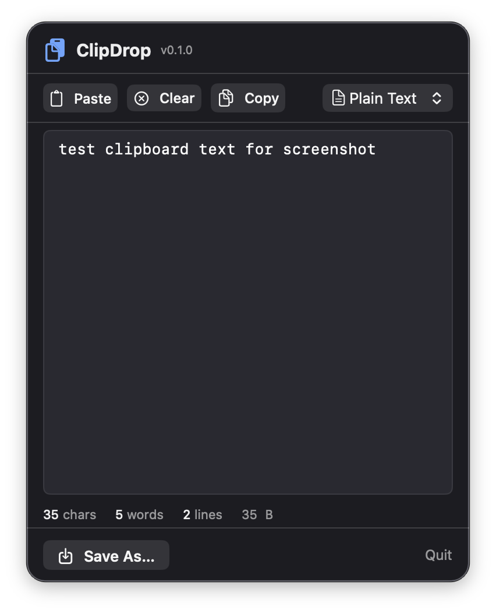

# ClipDrop

Clipboard-to-file menu bar app. Read clipboard text, edit it, save to any file format.



## Why

I copy text all the time — code snippets, log output, API responses — and want to save it as a file without opening a full editor. ClipDrop is the shortest path from clipboard to file: click the menu bar icon, pick a file type, save. That's it.

## Install

### Homebrew (recommended)

```bash
brew tap scasella/tap
brew install --cask clipdrop
```

Signed, notarized, and stapled — no Gatekeeper warnings.

### Build from source

```bash
git clone https://github.com/scasella/ClipDrop.git
cd ClipDrop
chmod +x build.sh
./build.sh
open ClipDrop.app
```

Requires macOS 14+.

## Quickstart

1. Copy some text to your clipboard
2. Click the clipboard icon in your menu bar
3. Edit the text if needed
4. Choose a file type (txt, md, swift, json, yaml, html, csv, log)
5. Click **Save As** — choose where to save
6. Done!

## Features

- **Auto-read clipboard** on popup open
- **8 file types** with correct UTType mappings: txt, md, swift, json, yaml, html, csv, log
- **Live stats** — character, word, line counts + byte size
- **Monospaced editor** — comfortable for code and structured text
- **Copy back** — edit and copy modified text back to clipboard
- **Remembers save directory** within session
- **Dark theme** — consistent with macOS dark mode

## Examples

**Save a code snippet:**
Copy Swift code → click ClipDrop → select "Swift" type → Save As → `snippet.swift`

**Clean up log output:**
Copy log lines → click ClipDrop → delete noise lines → select "Log" type → Save As → `debug.log`

**Quick markdown note:**
Copy text from a webpage → click ClipDrop → add headers/formatting → select "Markdown" → Save As → `notes.md`

**Export CSV data:**
Copy tab/comma data → click ClipDrop → select "CSV" → Save As → `data.csv`

**Save JSON response:**
Copy API response → click ClipDrop → select "JSON" → Save As → `response.json`

## Troubleshooting

- **"Clipboard is empty or contains non-text data"** — ClipDrop only reads text. Images, files, and rich content are not supported.
- **Menu bar icon not visible** — check if it's hidden behind the notch or other icons. Try expanding the menu bar area.
- **Save fails** — check write permissions on the target directory.

## License

MIT
